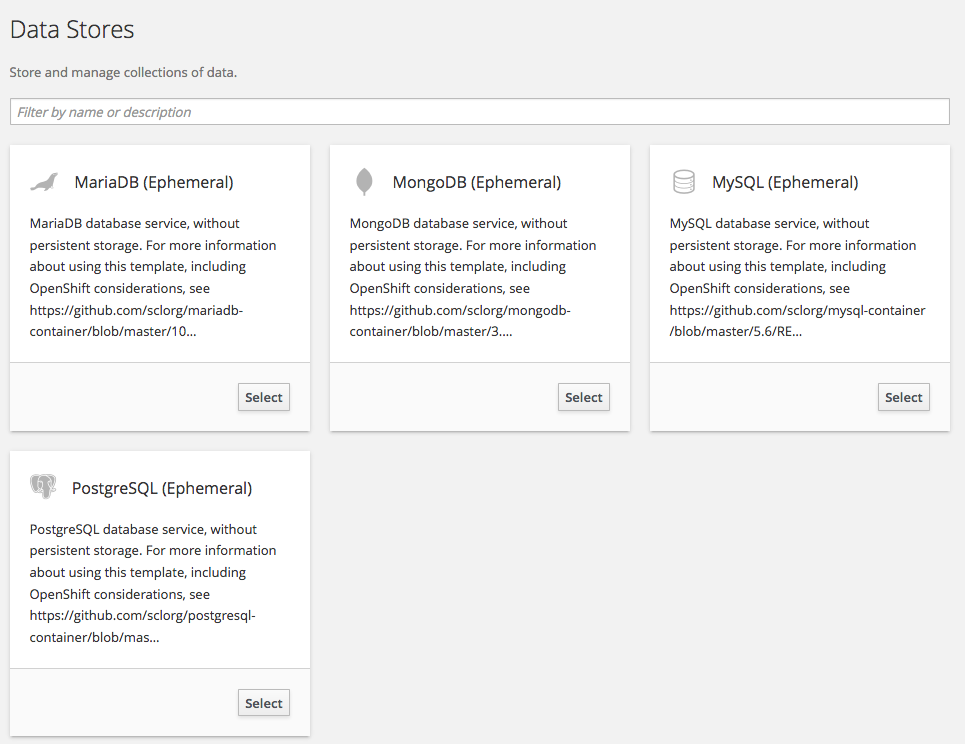
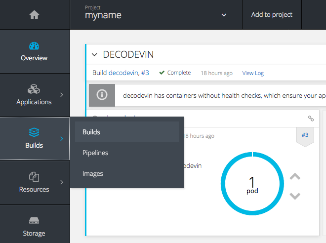
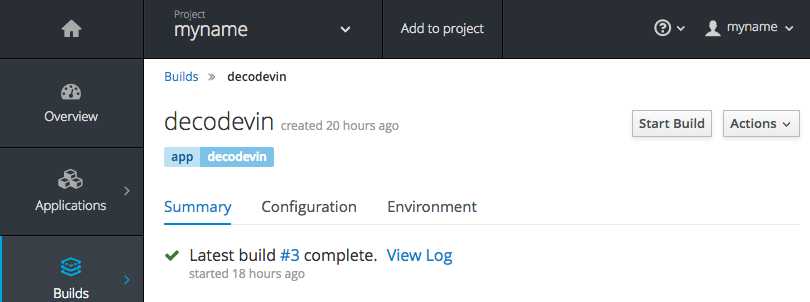
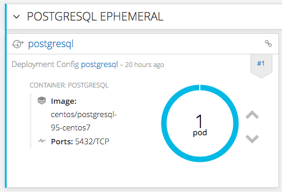
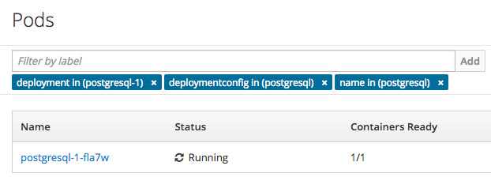
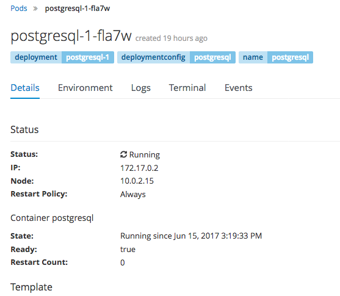
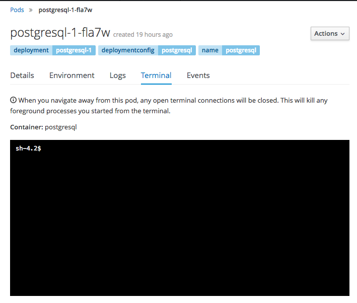

# Exercise No 2 - Connect to PostgreSQL

## Overview of this Exercise

The goal of this exercise is to deploy a PostgreSQL DB to Openshift and to connect the service to it. The following section shows how to do that step by step. 

## Step 1: Create a PostgreSQL DB on Openshift

Open the Openshift Web Console again. 
Click on "Add to project"

You should see this screen:


This shows a list of available images / templates. These are categorized into sections, now we will use "Data Stores.

Click "Data Stores". You should see this screen:



We want to use a PostgreSQL db. 

Click Select on "PostgreSQL (Ephemeral)". 
You should see this screen:


This allows you to configure the DB you want to create. We will leave almost all defaults, but enter the username "username" and password "password".

Enter:

* PostgreSQL Connect Username: `username`
* PostgreSQL Connect Password: `password`

and leave the rest as is. Click on `Create`.

You should see this screen:


Click on "Continue to Overview". There should be a new Pod visible, like shown in the following screen. If not, wait a few minutes and look while Openshift deploys the DB.


Congratulations, you just deployed a PostgreSQL DB on Openshift.

## Step 2: Connect the service to the Database

In order to connect the service to the DB we will have to provide the connection parameters in Openshift in the source code. The existing source code uses a Default database of JEE - we will change that so that it uses the PostgreSQL db.

We will hard code the connection properties. Later (if you have time) you can do it the proper way with environment variables and secrets.  

Open the file `web.xml` in the IDE:

Modify it, so it looks like this:

```
<web-app id="vin-decoder"
         xmlns="http://java.sun.com/xml/ns/javaee"
         xmlns:xsi="http://www.w3.org/2001/XMLSchema-instance"
         xsi:schemaLocation="http://java.sun.com/xml/ns/javaee
	      http://java.sun.com/xml/ns/javaee/web-app_3_0.xsd"
         version="3.0">
  <display-name>Archetype Created Web Application</display-name>
  
  <data-source>
    <name>java:ds/imagedb</name>
    <class-name>org.postgresql.ds.PGSimpleDataSource</class-name>
    <server-name>postgresql</server-name>
    <port-number>5432</port-number>
    <database-name>sampledb</database-name>
    <user>username</user>
    <password>password</password>
  </data-source>

</web-app>
```

Next open the file persistence.xml

Modify this file so it has this content:

```
<persistence xmlns="http://java.sun.com/xml/ns/persistence" xmlns:xsi="http://www.w3.org/2001/XMLSchema-instance"
             xsi:schemaLocation="http://java.sun.com/xml/ns/persistence http://java.sun.com/xml/ns/persistence/persistence_2_0.xsd"
             version="2.0">
  <persistence-unit name="imagedb" transaction-type="JTA">
    <jta-data-source>java:ds/imagedb</jta-data-source>
    <exclude-unlisted-classes>false</exclude-unlisted-classes>
    <validation-mode>CALLBACK</validation-mode>
    <properties>
      <property name="hibernate.hbm2ddl.auto" value="update" />
    </properties>
  </persistence-unit>
</persistence>
```

Commit and push your changes in git. 

## Step 3: Rebuild the service to activate the changes

Next, rebuild the service in Openshift. To do so, open the Openshift Web Console. Click on Builds / Builds like shown in the following screen shot. Click Builds.



Open the build config with the name of the service `decode-vin`.

In the screen after that click on "Start Build".



Head back to the Overview. After a few minutes you should see that the build completed and the service was redeployed.

Click on the URL again and verify that the service still works. 

Again, it can take a few minutes for the service to start up. Until then it will respond with 404 or 503 error codes due to the missing health probes. 

## Step 4: Fill some data

Let us manually fill some data into the DB. This time we will use the Openshift CLI.

#### Login with the CLI

Use the same URL like you use to access the web console:

`oc login https://<server>:8443`

You will have to enter the username and password and also will have to accept insecure connection.

#### List the pods

Execute this command

`oc get pods -l deploymentconfig=postgresql` 

You will get a list of pods like this:

```
NAME                 READY     STATUS    RESTARTS   AGE
postgresql-1-p2emv   1/1       Running   0          14m
```

#### Connect to the pod

Execute this command by using the name of the pod from the list

`oc rsh postgresql-1-p2emv`

Now you should have a shell prompt connected to the Pod like this:

```
sh-4.2$
```

#### Start psql to connect to the DB

```
psql -d sampledb -U username -W
```

#### See if the table is there. 

```
select * from vehicleimage;
```

You should get:

```
sampledb=> select * from vehicleimage;
 identifier | imageurl | vds | wmi 
------------+----------+-----+-----
(0 rows)
```
If not, rebuild and restart the service and look for errors in the build or startup. The service should have created the tables when it was started.

#### Insert some data

```
insert into vehicleimage (identifier, imageurl, wmi, vds) 
values (1, 'http://www.vwcult.com/wp-content/uploads/vw-kafer-monster-531.jpg', 'WVW', 'ZZZ3BZ');
```

#### Logout

Type `^D` to disconnect from psql and once more to disconnect from the shell.

### Step 4b - using the Openshift Web Console

Instead of the CLI you can use the Web Console. Yet this will not allow you to copy & paste. You can skip this section if you had success with the CLI. 

Go to the Openshift Web Console and open the PostgreSQL Pod. You can do that by clicking on the round graph showing the Pod:



After clicking the Pod, you get a list with all running pods (just one here):



Click the `postgresql-1-??????` link. You get this screen



Click on Terminal. You get a terminal connected to the pod.



Enter the commands like shown with the CLI. 

## Step 5: Verify

Open the service via the web page and see if it select the image url from the DB.
You should get some result like

```
{ "wmi":"WVW","year":1998,"vds":"ZZZ3BZ","vis":"WE689725","image":"http://www.vwcult.com/wp-content/uploads/vw-kafer-monster-531.jpg" }
```

## Things to try

Finished already? Try out the following things:

* Replace the username and password parameters in the web.xml with `${env.POSTGRESQL_USERNAME}` and `${env.POSTGRESQL_PASSWORD}`. 
* Set the environment Variables `POSTGRESQL_USERNAME` and `POSTGRESQL_PASSWORD` in the `decodevin` Deployment Config.

Please note that the deployment will run into errors if the authentication doesnt't work. In that case, the Wildfly will start but the application is not deployed. See the log in the Pod if that happens, it will show errors. 

Still have some time?

* Create a secret postgresql-secret for the password. You can do that like this with the CLI:

```
oc secret new-basicauth postgresql-secret --username=username --password=password
```

* Update the Deployment Config `decodevin` to mount the secret as variable. See this example:

```
      env:
        - name: POSTGRESQL_USERNAME
          valueFrom:
            secretKeyRef:
              name: postgresql-secret
              key: username
        - name: POSTGRESQL_PASSWORD
          valueFrom:
            secretKeyRef:
              name: postgresql-secret
              key: password              
```


