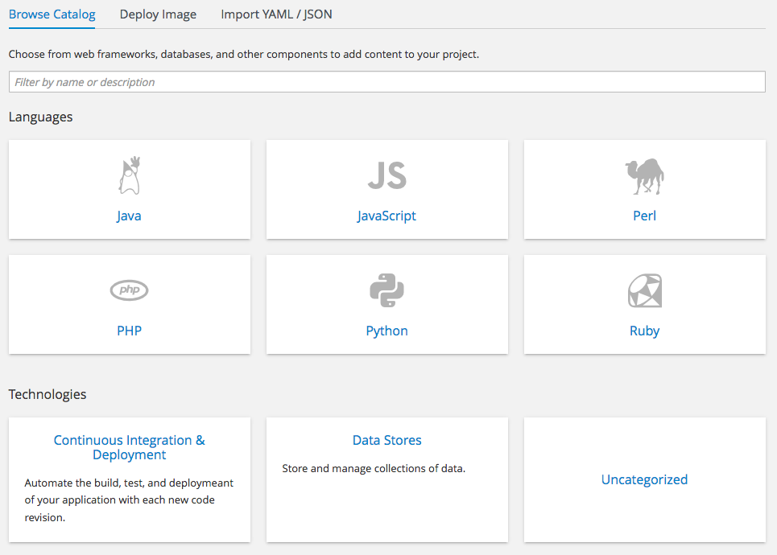
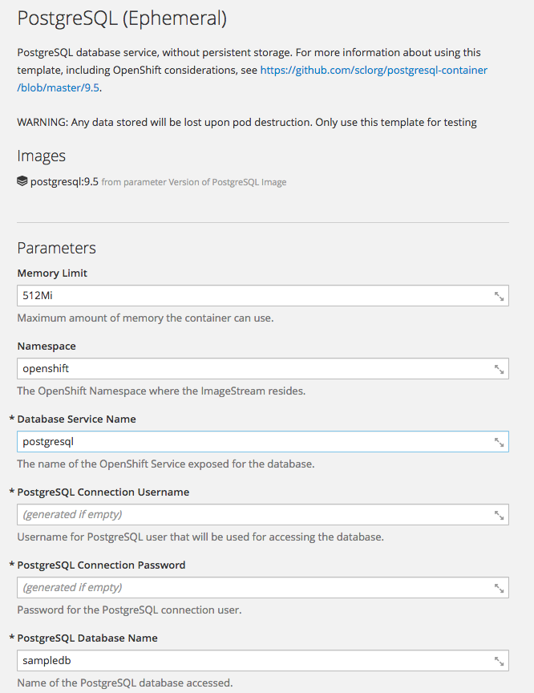
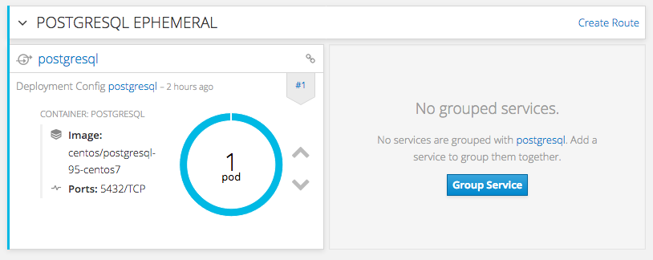

# Exercise No 2 - Connect to PostgreSQL

## Overview of this Exercise

The goal of this exercise is to deploy a PostgreSQL DB to Openshift and to connect the service to it. The following section shows how to do that step by step. 

## Step 1: Create a PostgreSQL DB on Openshift

Open the Openshift Web Console again. 
Click on "Add to project"

You should see this screen:



This shows a list of available images / templates. These are categorized into sections, now we will use "Data Stores.

Click "Data Stores". You should see this screen:


We want to use a PostgreSQL db. 

Click Select on "PostgreSQL (Ephemeral)". 
You should see this screen:



This allows you to configure the DB you want to create. We will leave almost all defaults, but just enter a username and password.

Enter:

* PostgreSQL Connect Username: `username`
* PostgreSQL Connect Password: `password`

and leave the rest as is. Click on `Create`.

You should see this screen:


Click on "Go to Overview". There should be a new Pod visible, like shown in the following screen. If not, wait a few minutes and look while Openshift deploys the DB.



Congratulations, you just deployed a PostgreSQL DB on Openshift.

## Step 2: Connect the service to the Database

In order to connect the service to the DB we will have to provide the connection parameters in Openshift in the source code. The existing source code uses a Default database of JEE - we will change that so that it uses the PostgreSQL db.

We will hard code the connection properties first. 

Open the file `web.xml` in the IDE:

Modify it, so it looks like this:

```
<web-app id="vin-decoder"
         xmlns="http://java.sun.com/xml/ns/javaee"
         xmlns:xsi="http://www.w3.org/2001/XMLSchema-instance"
         xsi:schemaLocation="http://java.sun.com/xml/ns/javaee
	      http://java.sun.com/xml/ns/javaee/web-app_3_0.xsd"
         version="3.0">
  <display-name>Archetype Created Web Application</display-name>
  
  <data-source>
    <name>java:ds/imagedb</name>
    <class-name>org.postgresql.ds.PGSimpleDataSource</class-name>
    <server-name>postgresql</server-name>
    <port-number>5432</port-number>
    <database-name>sampledb</database-name>
    <user>username</user>
    <password>password</password>
  </data-source>

</web-app>`
```

Next open the file persistence.xml

Modify this file so it has this content:

```
<persistence xmlns="http://java.sun.com/xml/ns/persistence" xmlns:xsi="http://www.w3.org/2001/XMLSchema-instance"
             xsi:schemaLocation="http://java.sun.com/xml/ns/persistence http://java.sun.com/xml/ns/persistence/persistence_2_0.xsd"
             version="2.0">
  <persistence-unit name="imagedb" transaction-type="JTA">
    <jta-data-source>java:ds/imagedb</jta-data-source>
    <exclude-unlisted-classes>false</exclude-unlisted-classes>
    <validation-mode>CALLBACK</validation-mode>
    <properties>
      <property name="hibernate.hbm2ddl.auto" value="update" />
    </properties>
  </persistence-unit>
</persistence>
```

Commit and push your changes in git. 

## Step 3: Rebuild the service to activate the changes

Next, rebuild the service in Openshift. To do so, open the Openshift Web Console. Click on Builds / Builds like shown in the following screen shot:


Open the build config with the name of the service `decode-vin`.

In the screen after that click on "Start Build".


Head back to the Overview. After a few minutes you should see that the build completed and the service was redeployed.

Click on the URL again and verify that the service still works. 

## Step 4: Fill some data

Let us manually fill some data into the DB.

Go to the Openshift Web Console and open the PostgreSQL Pod. You can do that by clicking on the round graph showing the Pod:


After clicking the Pod, you get a list with all running pods (just one here):


Click the `postgresql-1-??????` link. You get this screen


Click on Terminal. You get a terminal connected to the pod.


Enter these commands to fill some data:

- Connect to the DB (enter password password)

  ```
psql -d sampledb -U username -W
```

- See if the table is there. 

  ```
select * from vehicleimage;
```

  If not, rebuild and restart the service and look for errors in the build or startup. The service should have created the tables when it was started.

- Insert some data

  ```
insert into vehicleimage (identifier, imageurl, wmi, vds) 
values (1, 'some url', 'WVW', 'ZZZ3BZ');
```

## Step 5: Verify

Open the service via the web page and see if it select the image url from the DB.
You should get some result like

```
{"wmi":"WVW","year":1998,"vds":"ZZZ3BZ","vis":"WE689725","image":"some url"}
```

## Things to try

Finished already? Try out the following things:

* Replace the connection parameters in the web.xml with `${env.USERNAME}` and so forth. 
* Set the environment Variables USERNAME in the  
* Login to the Pod with the terminal (you find that in the Pod / Terminal) section. Kill the java process. See what happens. This is "Self Healing". 


