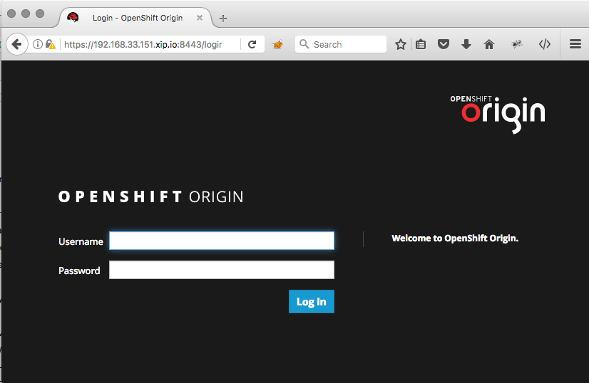
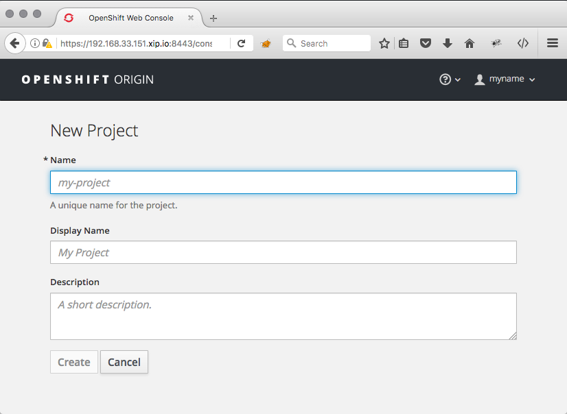
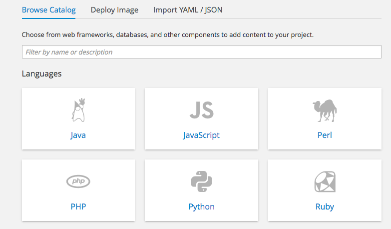
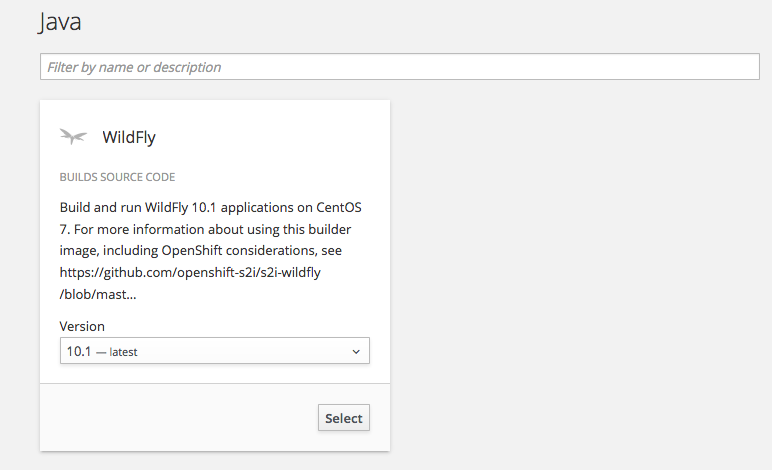
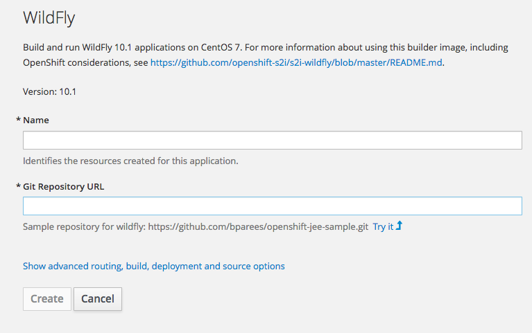
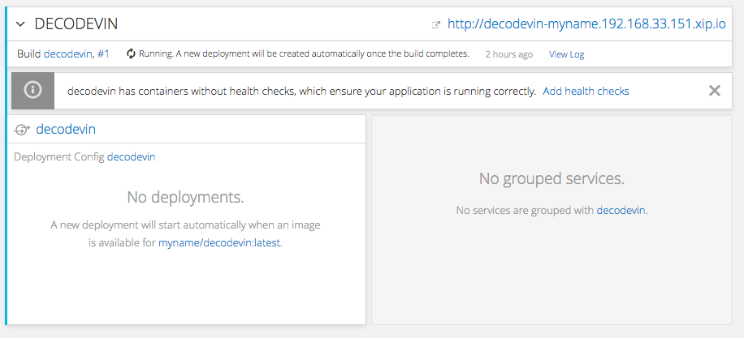
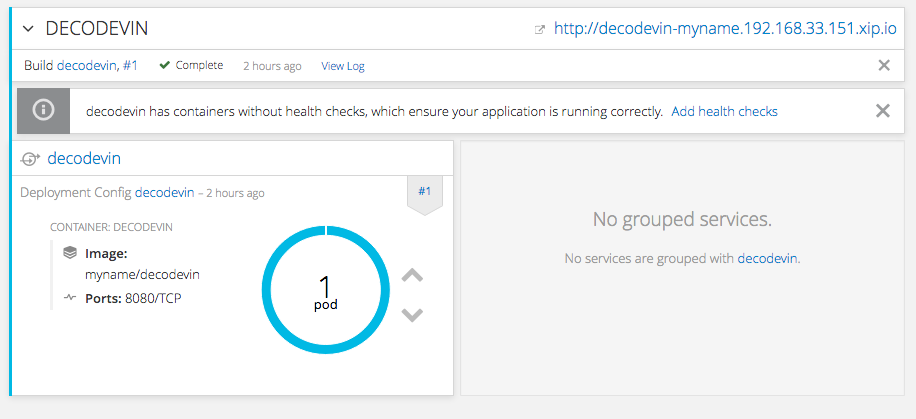
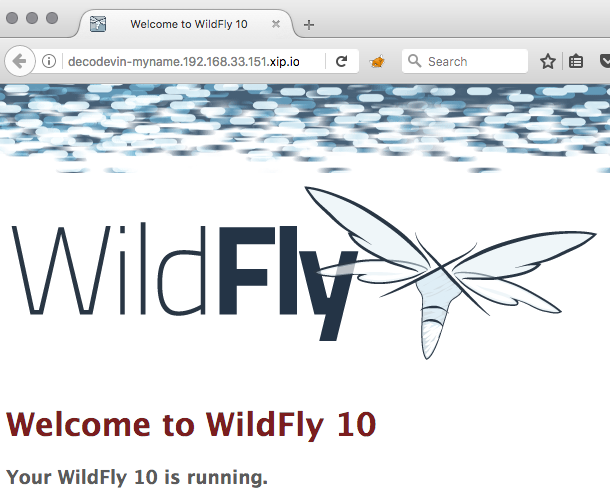
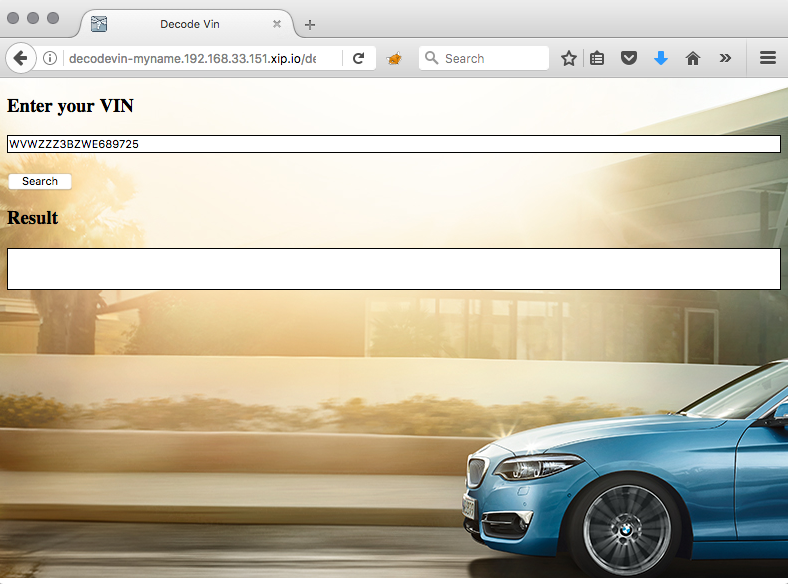

# Getting the Microservice up and running

This page will show you, how to build and deploy the service on Openshift. 

## Step 1: Logon to Openshift

Use Firefox or Chrome to connect to the Openshift Webconsole. Safari, Internet Explorer or Edge do not work well with it. 

Open the URL `https://<server>:8443`

The console does not have a valid certificate, so accept the security warnings and connect anyway.



Enter a username and password. Any password will do, as authorization is not activated. If you log on the first time, this will create a user for you.

Next, create a project. Any name will do, but the name has to be unique for all projects for all users. Maybe use your name?



## Step 2: Build and Deploy the service

The goal of this section is to have the microservice deployed on Openshift. 

After doing Step 1 you should see a screen like this:



If not, open the project, navigate to the "Overview", and click "Add to project". 

Click on "Java". You should see this screen:



Use the default selection "Wildfly" and version "10.1" and click select. You should see this screen:



Enter a name, `decodevin` and the git url for cloning this repository: `https://github.com/nextstepman/decodevin.git`.

This git repository is public, therefore this works without providing any credentials. 

Click Create. You should get a screen like this:


Click on "Continue to Overview"

You should see a screen like the following:



It shows that the code is now compiled. You can ignore the message about missing health checks. 

If you get an error `An error occurred getting metrics`, this is because of missing certificates. 


Click on `Open metrics URL` and accept the certificate warnings until you see the Hawkular Metrics eagle like this:


You can close that window with the eagle and head back to the Openshift Web Console. Reload the console and the error should be gone. 

The screen on the Openshift Web Console will autoupdate and you can see what happens. After a short time, Openshift will deploy the service and the screen will update to the following:



If this doesn't happen within a few minutes, look if the build or deployment failed. There are links to the log files on the screen as `View Log`. 

## Step 3: Test the service

There is an URL at the Top of the screen. 


Click on it. 

Maybe you get certificate warnings again. If so accept these.

You should get this screen:



This is the start screen of the deployed application server. 

The microservice has a simple GUI for demonstration purposes. Add the `/decode-vin/index.jsp` to the URL you just opened for the Wildfly. It should look like this:

`http://decodevin-<myname>.<ip>.xip.io/decode-vin/index.jsp`

You should see this screen:



If you get some 503 or 404 errors, retry. Even if Openshift reports the service as deployed, the application might not be startup yet. 

This is because we have no health probes - this is what that warning was about.

If you don't get this screen after a few minutes, have a look at the deployment logs. Maybe Wildfly did run into errors when starting up.

Next click on "Search". The microservice will show this result:

```
{"wmi":"unknown","year":0,"vds":"unknown","vis":"unknown","image":null}
```

If you prefer, you can also use the microservice directly. Just open the URL like this:

`
http://decodevin-<myname>.<ip>.xip.io/decode-vin/api/v1/vehicledata/WVWZZZ3BZWE689725
`

You should get the same result like above.

The VIN must be 14 characters long. If not, you will get a http code 400.

Congratulations, you just build and deployed the service on Openshift.

## Things to try

Finished already? Try out the following things:

* Go to the Openshift Web Console and go exploring. Have a look at the BuildConfig, DeploymentConfig, Service and Route definitions. Open the YAML content.

And if you still have time:

* Install the Openshift CLI and use the oc command to connect to Openshift with `oc login https://<server>:8443`. 
* Go explore the contents by using commands `oc get pods`, `oc get bc` 
* Use `oc -h` to see what other commands are there and try some.